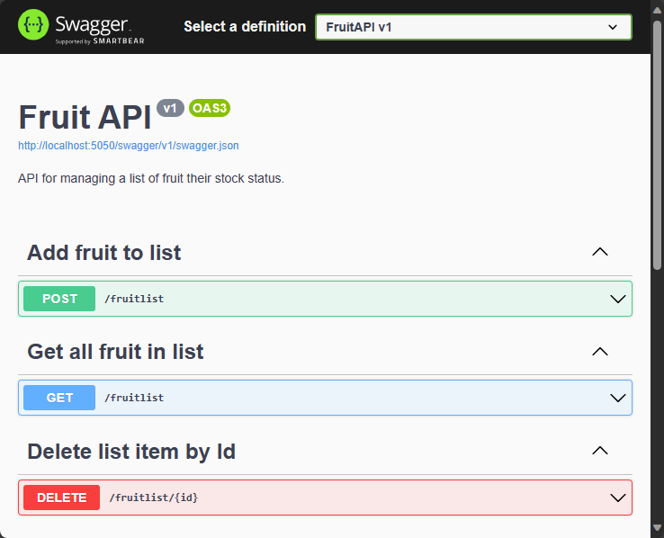
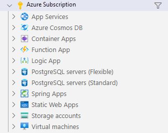

---
lab:
  title: '演習: ASP.NET Core の最小 API を操作'
  module: 'Module: Interact with an ASP.NET Core minimal API'
---

この演習では、ASP.NET Core の最小 API をローカルで実行し、API と基になるコードを調べます。 また、API を Azure App Service に公開します。 

この演習を終了すると、次のことができるようになります。

* ドキュメント化された API を移動する
* HTTP 操作のエンドポイントを決定する
* HTTP 操作の API 要件を特定する
* アプリを Azure App Service に公開する

## 前提条件

演習を完了するには、次の項目がシステムにインストールされている必要があります。

* [Visual Studio Code](https://code.visualstudio.com)
* [最新の .NET 8.0 SDK](https://dotnet.microsoft.com/download/dotnet/8.0)
* Visual Studio Code 用の [C# 拡張機能](https://marketplace.visualstudio.com/items?itemName=ms-dotnettools.csharp)
* Visual Studio Code 用の [Azure リソース](https://marketplace.visualstudio.com/items?itemName=ms-azuretools.vscode-azureresourcegroups)拡張機能。
* Visual Studio Code 用の [Azure App Service](https://marketplace.visualstudio.com/items?itemName=ms-azuretools.vscode-azureappservice) 拡張機能。
* アクティブなサブスクリプションが含まれる Azure アカウント。 アカウントを取得済みでない場合は、[https://azure.com/free](https://azure.com/free) から無料評価版にサインアップできます。

**この演習の推定所要時間**: 30 分

## API 情報

API は、次のフィールドを含むメモリ内データベースとやり取りします。

フィールド | タイプ | Description
--- | --- | ---
`id` | integer | データのキー
`name` | string | 果物の名前
`instock` | boolean | 果物が在庫にあるかどうかを示します

Swagger ドキュメントは、Swashbuckle パッケージを使用して作成されました。

>**注:** サンプル データは、API が開始されるたびに作成されます。


## Fruit API コードのダウンロードと実行

このセクションでは、次の作業を行います。

* API コードをダウンロードする
* API をローカルで実行する
* ブラウザーで API ドキュメントを開く

### タスク 1: API コードをダウンロードする

1. 次のリンクを右クリックし、**[名前を付けてリンク先を保存]** オプションを選択します。 

    * [FruitAPI プロジェクト コード](https://raw.githubusercontent.com/MicrosoftLearning/APL-2002-develop-aspnet-core-consumes-api/master/Allfiles/Downloads/FruitAPI.zip) コード

1. **エクスプローラー**を起動し、ファイルが保存された場所に移動します。

1. ファイルを独自のフォルダーに解凍します。

#### タスク 2: API をローカルで実行する

1. Visual Studio Code で、**[ファイル]** を選択し、**[フォルダーを開く...]** を選びます。

1. プロジェクト ファイルを解凍した場所に移動し、*FruitAPI* フォルダーを選択します。

1. **エクスプローラー** ペインのプロジェクト構造は、次のスクリーンショットのようになります。 メニュ バーに**エクスプローラー** パネルが表示されない場合は、**[表示]** を選んで、**[サーバー エクスプローラー]**] を選びます。

    

1. **[ターミナル]**、**[新しいターミナル]** の順に選択するか、キーボード ショートカットの **Ctrl + Shift +`** を使用して、VS Code でターミナルを開きます。

1. **ターミナル** ペインで、次の `dotnet` コマンドを実行します。

    ```
    dotnet run
    ```

1. **ターミナル** ペインに表示される出力の例を次に示します。 出力内の `Now listening on: http://localhost:5050` 行をメモします。 API のホストとポートを識別します。

    ```
    info: Microsoft.EntityFrameworkCore.Update[30100]
          Saved 3 entities to in-memory store.
    info: Microsoft.Hosting.Lifetime[14]
          Now listening on: http://localhost:5050
    info: Microsoft.Hosting.Lifetime[0]
          Application started. Press Ctrl+C to shut down.
    info: Microsoft.Hosting.Lifetime[0]
          Hosting environment: Development
    info: Microsoft.Hosting.Lifetime[0]
          Content root path: 
          <project location>
    ```

### タスク 3: ブラウザーで API ドキュメントを開く

1. API を表示するには、アドレス バーに `http://localhost:5050` を入力するか、前に示した**ターミナル**のリンク `Now listening on: http://localhost:5050` を **Ctrl キーを押しながらクリック**します。 ページに「この localhost ページが見つかりません」というメッセージが表示されます。

1. ブラウザーの URL に `/swagger` を追加します。 `/swagger` エンドポイントは通常、Swagger API のドキュメントの場所です。 Swagger ドキュメントの完全な URL は `http://localhost:5050/swagger` です。 ブラウザーに、次のスクリーンショットのような Web ページが表示されます。

    

## API で操作を実行

このセクションでは、次の作業を行います。

* サンプル データに対して複数の操作を実行する
* 操作のエンドポイントとデータの要件を特定する

### タスク 1: `GET` 操作を実行する

1. **[GET]** 操作ボックス内の任意の場所をクリックして、**[すべての果物を取得]** 記述子付きの **GET** 操作を展開します。

1. 操作のセクションを調べて、次の表に示す情報を書き留めます。

    | セクション | 説明 |
    |---|--|
    | **エンドポイント** | 操作のヘッダーに表示されます。 エンドポイントは `/fruits` のように表示されます。 完全な URI は、指定されたエンドポイント (この例では `http://localhost:5050/fruits`) が追加された API のベース URL です。 |
    | **パラメーター** | この操作には必要ありません。 |
    | **メディアのタイプ** | 操作が返すメディアのタイプのエンコードを指定します。 |
    | **例の値** | 操作が返すデータのスキーマを表示します。 この操作では JSON 配列が返されることに注意してください。 |

1. **[試してみる]** ボタン、**[実行]** の順に選んで操作を実行します。

1. 操作の **[応答]** セクションが新しい情報で更新されました。 次の点に注意してください。

    * **要求 URL:** 操作でアクセスされた URL。
    * **サーバー応答:** 操作の成功コードが表示され、**応答の本文**には 3 つのサンプル レコードが表示されます。

### タスク 2: `POST` 操作を実行する

1. **[POST]** 操作ボックス内の任意の場所をクリックして、**[新しい果物を作成]** 記述子付きの **POST** 操作を展開します。

1. 操作のセクションを調べて、次の表に示す情報を書き留めます。

    | セクション | 説明 |
    |---|--|
    | **エンドポイント** | エンドポイントは `/fruits` のように表示されます。 完全な URI は、指定されたエンドポイント (この例では `http://localhost:5050/fruits`) が追加された API のベース URL です。 |
    | **パラメーター** | この操作には必要ありません。 |
    | **要求本文** | **要求本文**は、リストにデータが追加されることと、メディアのタイプが `application/json` であることが API で想定されているために必要です。 |
    | **例の値** | API が受け取るデータのスキーマを表示します。 |  

1. 操作を実行するには、**[試してみる]** ボタンを選択します。 

1. **[要求本文]** セクションの入力ボックスの JSON を次のように置き換えます。

    ```json
    {
        "id": 0,
        "name": "Pear",
        "instock": true
    }
    ```

    >**注:** データベースは、データを追加するときに独自のインデックス値を割り当てます。そのため、`id` フィールドに値を指定するだけで済みます。

1. 操作の **[応答]** セクションが新しい情報で更新されました。 次の点に注意してください。

    * **要求 URL:** 操作でアクセスされた URL。
    * **サーバー応答:** 操作の成功コードが表示され、**応答本文**にはデータベースに追加されたレコードが表示されます。

1. **[すべての果物を取得]** セクションで `GET` コマンドを実行し、*梨*のレコードが含まれていることを確認します。

### タスク 3: `DELETE` 操作を実行する

1. **[DELETE]** 操作ボックス内の任意の場所をクリックして、**[ID で果物を削除]** 記述子付きの **DELETE** 操作を展開します。

1. 操作のセクションを調べて、次の表に示す情報を書き留めます。

    | セクション | 説明 |
    |---|--|
    | **エンドポイント** | エンドポイントは `/fruits/{id}` のように表示されます。 完全な URI は、API のベース URL に、削除に指定する `id` を追加したものです。 たとえば、`http://localhost:5050/fruits/1` は、`id` が `1` であるレコードを指します。
    | **パラメーター** | 要求 URL でレコードの `id` を渡す必要があります。 |

1. 操作を実行するには、**[試してみる]** ボタンを選択します。 

1. サンプル データの `Apple` レコードを削除するには、**[パラメーター]** セクションの`id`フィールドに `1` を入力し、**[実行]** を選びます。

1. 操作の **[応答]** セクションが新しい情報で更新されました。 次の点に注意してください。

    * **要求 URL:** 操作でアクセスされた URL。
    * **応答本文:** 削除されたレコードを表示します。
    * **コード:** 操作の成功コードを示します。

1. **[すべての果物を取得]** セクションで `GET` コマンドを実行し、*りんご*のレコードが削除されていることを確認します。

演習の次のセクションに進む準備ができたら、

* ブラウザーを閉じ、実行中のターミナルで Ctrl + C** キーを**押して Fruit API を停止します。

## Azure App Service に Web API を発行する

このセクションでは、次の作業を行います。

* Azure リソース拡張機能を使用して Azure に接続する
* Azure App Service 拡張機能を使用して、API を App Service に公開する

### タスク 1: Azure にサインインする

1. Azure リソース拡張機能を選択してパネルを開きます。

    

1. **[Azure にサインイン...]** を選択します。

    ブラウザー ウィンドウが開き、Azure アカウントへのサインインを求められます。 サインインが完了したら、このウィンドウを閉じることができます。 

1. サインインが完了すると、拡張機能によってアカウントで使用可能なサブスクリプションの一覧が表示されます。 次のスクリーンショットに例を示します。

    

### タスク 1: 新しい Web アプリを作成する

1. **Ctrl + Shift + P** キーを押してコマンド パレットを開き、**「新しい Web アプリの作成」** と入力して一覧をフィルター処理し、**[Azure App Service: 新しい Web アプリの作成...(詳細設定)]** オプションを選択します。 

1. アカウントに複数のサブスクリプションがある場合は、デプロイに使用するサブスクリプションを選択するように求められます。 

1. 新しい Web アプリのグローバルに一意の名前を入力します。 `fruitapi-<name>` を使用し、`<name>` を自分の名前またはイニシャルに置き換えることができます。

1. **[+新しいリソース グループの作成]** を選択し、既定値をそのまま使用するか、「`fruitapi-rg`」と入力します。

1. ランタイム スタックに **.NET 8 (LTS)** を選択します。

1. オペレーティング システムに **Linux** を選択します。

1. 近い場所にある新しいリソースの保存先を選択します。

1. **[新しい App Service プランの作成]** を選択し、既定値をそのまま使用するか、別の名前を入力します。 

1. 価格レベルには **[無料 (F1) 無料で Azure を試す]** を選択します。

1. 新しい Application Insights リソースを選択するよう求められたら、**[後で確認する]** を選択します。

このツールは、Azure に必要なリソースを作成し、コードをコンパイルします。

### タスク 3: Web アプリを配置し、実行中のサイトを参照する

1. リソースが作成され、コードのコンパイルが完了すると、ウィンドウがポップアップ表示され、**デプロイ**を求めるメッセージが表示されるので、**[デプロイ]** オプションを選択します。 

    システムでコードのリリース バージョンがビルドされ、先ほど作成したリソースにデプロイされます。

1. デプロイが完了すると、**[Web サイトの参照]** オプションが表示された新しいポップアップが表示されるので、**[Web サイトの参照]** を選択します。

1. 開いたブラウザー ウィンドウで、URL の最後に「`/fruits`」と入力する必要があります。 すべてのデータを示す API からの生出力が表示されます。

    >**注:** Swagger UI は開発環境でのみ有効になっているため無効です。 追加の構成を実行しない限り、App Service へのデプロイは非開発環境と見なされます。

これで、API が Azure App Service に正常にデプロイされました。

>**注:** 不要になったリソースを Azure から削除することをお勧めします。 演習のこのセクションで作成したすべてのリソースは、Azure portal で前に作成したリソース グループを削除することで削除できます。

## 確認

この演習では、以下の方法を学習しました。

* ドキュメント化された API を移動する
* HTTP 操作のエンドポイントを決定する
* HTTP 操作の API 要件を特定する
* アプリを Azure App Service に公開する 
