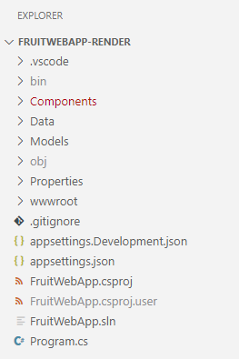
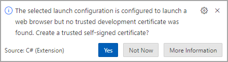

---
lab:
  title: '演習: ASP.NET Core Blazor Web アプリで API 応答をレンダリングする'
  module: 'Module: Render API responses in ASP.NET Core Blazor Web apps'
---

この演習では、ASP.NET Core Blazor Web アプリにコードを追加して、HTTP 操作の結果をレンダリングする方法について学びます。 このコードは *.razor* ファイルに追加されます。 *.razor.cs* ファイルで操作を実行するコードが完了しています。

## 目標

この演習を終了すると、次のことができるようになります。

* アプリに Razor 構文を実装する
* C# コードを Razor 構文と統合する

## 前提条件

演習を完了するには、次の項目がシステムにインストールされている必要があります。

* [Visual Studio Code](https://code.visualstudio.com)
* [最新の .NET 8.0 SDK](https://dotnet.microsoft.com/download/dotnet/8.0)
* Visual Studio Code 用の [C# 拡張機能](https://marketplace.visualstudio.com/items?itemName=ms-dotnettools.csharp)

**この演習の推定所要時間**: 30 分

## 演習のシナリオ

この演習には、次の 2 つのコンポーネントがあります。

* API に HTTP 要求を送信する Web アプリ。 アプリは `http://localhost:5010` で実行します
* HTTP 要求に応答する API。 API は `http://localhost:5050` で実行します


## コードのダウンロード

このセクションでは、Fruit Web アプリと Fruit API のコードをダウンロードします。 また、Fruit API をローカルで実行して、Web アプリで使用できるようにします。

### タスク 1: API コードをダウンロードして実行する

1. 次のリンクを右クリックし、**[名前を付けてリンク先を保存]** オプションを選択します。 

    * [FruitAPI プロジェクト コード](https://raw.githubusercontent.com/MicrosoftLearning/APL-2002-develop-aspnet-core-consumes-api/master/Allfiles/Downloads/FruitAPI.zip) コード

1. **エクスプローラー**を起動し、ファイルが保存された場所に移動します。

1. ファイルを独自のフォルダーに解凍します。

1. **Windows ターミナル**または**コマンド プロンプト**を開き、API のコードを抽出した場所に移動します。

1. **Windows ターミナル** ペインで次の `dotnet` コマンドを実行します。

    ```
    dotnet run
    ```

1. 生成された出力の例を次に示します。 出力内の `Now listening on: http://localhost:5050` 行をメモします。 API のホストとポートを識別します。

    ```
    info: Microsoft.EntityFrameworkCore.Update[30100]
          Saved 3 entities to in-memory store.
    info: Microsoft.Hosting.Lifetime[14]
          Now listening on: http://localhost:5050
    info: Microsoft.Hosting.Lifetime[0]
          Application started. Press Ctrl+C to shut down.
    info: Microsoft.Hosting.Lifetime[0]
          Hosting environment: Development
    info: Microsoft.Hosting.Lifetime[0]
          Content root path: 
          <project location>
    ```

>**注:** Fruit API は、以降の演習が終わるまで実行したままにします。 

### タスク 2: Web アプリ プロジェクトをダウンロードして開く

1. 次のリンクを右クリックし、**[名前を付けてリンク先を保存]** オプションを選択します。 

    * [Fruit Web アプリのレンダリング プロジェクト コード](https://raw.githubusercontent.com/MicrosoftLearning/APL-2002-develop-aspnet-core-consumes-api/master/Allfiles/Downloads/FruitWebApp-render.zip)

1. **エクスプローラー**を起動し、ファイルが保存された場所に移動します。

1. ファイルを独自のフォルダーに解凍します。

1. Visual Studio Code で、**[ファイル]** を選択し、**[フォルダーを開く...]** を選びます。

1. プロジェクト ファイルを解凍した場所に移動し、*FruitWebApp-render* フォルダーを選択します。

1. **エクスプローラー** ペインのプロジェクト構造は、次のスクリーンショットのようになります。 メニュ バーに**エクスプローラー** パネルが表示されない場合は、**[表示]** を選んで、**[サーバー エクスプローラー]**] を選びます。

    

>**注:** この演習全体を通して編集されている各ファイルのコードについて、時間をかけて確認してください。 このコードには多数のコメントが付いているため、コード ベースを理解するのに役立ちます。

## ホーム ページにデータをレンダリングするコードを実装する

Fruit Web アプリは、ホーム ページに API サンプル データを表示します。 分離コード ファイルで実行された HTTP `GET` 操作によって返されるサンプル データを反復処理するコードを、追加する必要があります。

### タスク 1: テーブルにデータをレンダリングするコードを追加する

1. **[エクスプローラー]** ペインで *Home.razor* ファイルを選択し、編集用に開きます。

1. `@* Begin render API data code block *@` と `@* End render API data code block *@` のコメント間に次のコードを追加します。

    ```razor
    <tbody>
        @*  The Razor explicit expression @foreach is used to iterate through the
            data returned to the data model from the HTTP operations. *@
        @foreach (var obj in _fruitList ?? [])
        {
            <tr>
                @* Display the name of the fruit. *@
                <td width="50%">@obj.name</td>
                @*  The following if statment changes the true/false of instock to Yes/No. *@
                @{
                    if (@obj.instock)
                    {
                        <td width="20%" class="text-md-center">
                            Yes
                        </td>
                    }
                    else
                    {
                        <td width="20%" class="text-md-center">
                            No
                        </td>
                    }
                }
                <td width="30%" class="text-center">
                    @* The following div renders the Edit and Delete buttons that pass the Id 
                        to a function that handles the navigation and passes the Id to the page. *@
                    <div class="w-75 btn-group btn-group-sm" role="group" style="text-align:center">
                        <button class="btn btn-primary  mx-2" @onclick="() => EditButton(obj.id)">
                            Edit
                        </button>
                        <button class="btn btn-danger mx-2" @onclick="() => DeleteButton(obj.id)">
                            Delete
                        </button>
                    </div>
                </td>
            </tr>
        }
    </tbody>
    ```

1. 変更を *Home.razor* に保存し、コード内のコメントを確認します。

1. Visual Studio Code の上部メニューで、**[実行]\| から [デバッグの開始]** を選択するか、**F5** を選択します。 プロジェクトのビルドが完了したら、Web アプリを実行してブラウザー ウィンドウを起動する必要があります

1. [インデックス] ページに API のサンプル データが表示されていることを確認します。

    >**注:** **リストに追加**、**編集**、および**削除**の各機能は、この演習の後半でコードを追加するまで動作しません。

    >**注:** アプリの実行時に以下のプロンプトが表示される場合は、無視しても問題ありません。

    

1. 演習を続行するには、ブラウザーまたはブラウザー タブを閉じ、Visual Studio Code で **[実行] \| [デバッグの停止]** の順に選択するか、**Shift + F5** キーを押します。

## リスト**に追加機能を**処理するコードを実装する

追加、編集、削除の各操作は、プロジェクト内の個別の *.razor* ページで処理されます。 このセクションでは、*Add.razor* ファイルでフォームを作成して、データをリストに追加できるようにするコードを追加します。

### タスク 1: コードを追加してデータ追加フォームを作成する

1. **[エクスプローラー]** ペインで *Add.razor* ファイルを選択し、編集用に開きます。

1. `@* Begin render Add code block *@` と `@* End render Add code block *@` のコメント間に次のコードを追加します。

    ```csharp
    @* Data is added using a Razor form, the data model is bound to the form.*@
    <EditForm OnSubmit="Submit" FormName="AddFruit" Model="_fruitList">
        @*  The _fruitList.id is here so the full data model is represented on the page.
            The database behind the API will assign the id. *@
        <InputNumber hidden="true" @bind-Value="_fruitList!.id" />
        <div class="border p-3 mt-4" style="width:50%">
            <div class="row pb-2">
                <h2 class="text-primary pl-3">Add Fruit</h2>
                <hr />
            </div>
            <div class="mb-3">
                <label class="h5"></label><br />
                @* Empty text box for the name of the fruit to be added. *@
                <InputText @bind-Value="_fruitList!.name" />
            </div>
            <div class="mb-3">
                <label class="h5"></label><br />
                @* Render the true/false instock state from the record in an editable checkbox. *@
                <InputCheckbox @bind-Value="_fruitList!.instock" style="width:20px; height:20px" />
                <label class="h7">Check the box if it's available.</label>
            </div>
            @* Submit the addition or return to the Index page if the Add is cancelled.*@
            <button @onclick="() => Submit()" class="btn btn-primary" style="width:150px;">Create</button>
            <a class="btn btn-secondary" style="width:150px;" href="/">Cancel</a>
        </div>
    </EditForm>
    ```
    
1. 変更を *Add.razor* に保存し、コード内のコメントを確認します。

1. Visual Studio Code の上部メニューで、**[実行]\| から [デバッグの開始]** を選択するか、**F5** を選択します。 プロジェクトのビルドが完了したら、Web アプリを実行してブラウザー ウィンドウを起動する必要があります

1. ページの **[リストに追加]** を選択します。

1. リストに追加するフルーツの名前を入力し、チェックボックスを選択して使用可能であることを示します。

1. ]**[作成]** を選択してリストにエントリを追加すると、ホーム ページにルーティングされます。 エントリがリストに追加されたことを確認します。

1. 演習を続行するには、ブラウザーまたはブラウザー タブを閉じ、Visual Studio Code で **[実行] \| [デバッグの停止]** の順に選択するか、**Shift + F5** キーを押します。

## 編集**機能を処理するコードを実装する**

このセクションでは、Edit.cshtml* ファイルにフォームを*作成して、リストへのデータの編集を有効にするコードを追加します。

### タスク 1: 編集フォームにコードを追加する

1. **[エクスプローラー]** ペインで *Edit.razor* ファイルを選択し、編集用に開きます。

1. `@* Begin render Edit code block *@` と `@* End render Edit code block *@` のコメント間に次のコードを追加します。

    ```csharp
    @* Data is edited using a Razor form, the data model is bound to the form.*@
    <EditForm OnSubmit="Submit" FormName="EditFruit" Model="_fruitList">
        @*  The id for the data record is hidden because it needs to be available to the 
            code-behind processing, but it's not displayed. *@
        <InputNumber hidden="true" @bind-Value="_fruitList!.id" />
        <div class="border p-3 mt-4" style="width:50%">
            <div class="row pb-2">
                <h2 class="text-primary pl-3">Edit Fruit</h2>
                <hr />
            </div>
            <div class="mb-3">
                <label asp-for="FruitModels.name" class="h5"></label><br/>
                @* Render the name of the fruit in an editable text box. *@
                <InputText @bind-Value="_fruitList!.name" />
            </div>
            <div class="mb-3">
                <label  class="h5"></label><br/>
                @* Render the true/false instock state from the record in an editable checkbox. *@
                <InputCheckbox @bind-Value="_fruitList!.instock" style="width:20px; height:20px" />
                <label class="h7"><i class="bi bi-arrow-left"></i>  Check the box if available.</label>
            </div>
            @* Submit the changes or return to the Index page if the Edit is cancelled.*@
            <button type="submit" class="btn btn-danger " style="width:150px;">Save</button>
            <a class="btn btn-secondary" style="width:150px;" href="/">Cancel</a>
        </div>
    </EditForm>
    ```

1. 変更を *Edit.razor* に保存し、コード内のコメントを確認します。

1. Visual Studio Code の上部メニューで、**[実行]\| から [デバッグの開始]** を選択するか、**F5** を選択します。 プロジェクトのビルドが完了したら、Web アプリを実行してブラウザー ウィンドウを起動する必要があります

1. 変更するリスト内の項目を選び、その行で **[編集]** を選択します。

1. フルーツの名前を編集し、チェックボックスを選択して、その可用性の状態を変更します。

1. **[更新]** を選択して変更を保存すると、ホーム ページにルーティングされます。 変更がリストに表示されていることを確認します。

1. 演習を続行するには、ブラウザーまたはブラウザー タブを閉じ、Visual Studio Code で **[実行] \| [デバッグの停止]** の順に選択するか、**Shift + F5** キーを押します。

## Delete** 機能を処理するコードを実装する**

このセクションでは、Delete.cshtml* ファイルにフォームを*作成するコードを追加して、リストからデータを削除できるようにします。

### タスク 1: 削除フォームのコードを追加する

1. **[エクスプローラー]** ペインで *Delete.razor* ファイルを選択し、編集用に開きます。

1. `@* Begin render Delete code block *@` と `@* End render Delete code block *@` のコメント間に次のコードを追加します。

    ```csharp
    @* Data is deleted using a Razor form, the data model is bound to the form.*@
    <EditForm OnSubmit="Submit" FormName="DeleteFruit" Model="_fruitList">
        @*  The id for the data record is hidden because it needs to be available to the 
            code-behind processing, but it's not displayed. *@
        <InputNumber hidden="true" @bind-Value="_fruitList!.id" />
        <div class="border p-3 mt-4" style="width:50%">
            <div class="row pb-2">
                <h2 class="text-primary pl-3">Delete Fruit</h2>
                <hr />
            </div>
            <div class="mb-3">
                <label asp-for="FruitModels.name" class="h5"></label><br/>
                @* Render the name of the fruit in a non-editable text box. *@
                <InputText @bind-Value="_fruitList!.name" Disabled/>
            </div>
            <div class="mb-3">
                <label  class="h5"></label><br/>
                @* Render the true/false instock state from the record in a non-editable checkbox. *@
                <InputCheckbox @bind-Value="_fruitList!.instock" style="width:20px; height:20px" Disabled  />
                <label class="h7">Check the box if available.</label>
            </div>
            @* Submit the changes or return to the Index page if the delete is cancelled.*@
            <button type="submit" class="btn btn-danger " style="width:150px;">Delete</button>
            <a class="btn btn-secondary" style="width:150px;" href="/">Cancel</a>
        </div>
    </EditForm>
    ```

1. 変更を *Delete.razor* に保存し、コード内のコメントを確認します。

1. Visual Studio Code の上部メニューで、**[実行]\| から [デバッグの開始]** を選択するか、**F5** を選択します。 プロジェクトのビルドが完了したら、Web アプリを実行してブラウザー ウィンドウを起動する必要があります

1. 削除するリスト内の項目を選択し、その行の **[削除]** を選択します。

1. **[削除]** を選択すると、ホーム ページに戻ります。 削除した項目がリストに表示されなくなったかどうかを確認します。

演習を終了する準備ができたら、次を実行します。

* ブラウザーまたはブラウザー タブを閉じ、Visual Studio Code で **[実行] \| [デバッグの停止]** を選択するか、**Shift + F5** キーを押します。 

* 実行中のターミナルで **Ctrl + C** キーを押して Fruit API を停止します。

## 確認

この演習では、以下の方法を学習しました。

* アプリに Razor キーワードを実装する
* C# コードを Razor Pages 構文と統合する
